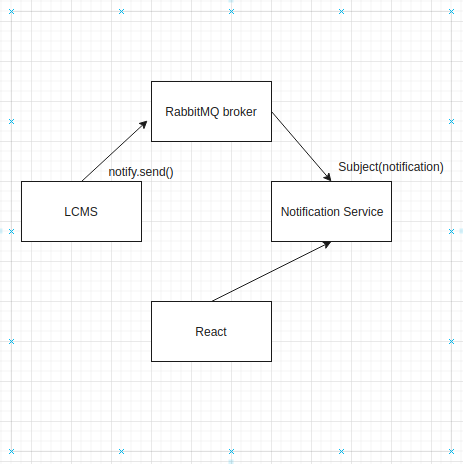

# UI Working
This article provides a working overview of the Notification API User Interface (or UI). Below is a screenshot of the UI with the different sections labeled below.



In the LCMS system the **actor**(user) will send the notification to the **target** with **verb** defines the description of the activity. Following is the notification that..
```md
from notification import notify
notify.send(user, recipient=user, verb, description) 
```
..will be send to the **RabbitMQ broker**.

**RabbitMQ broker** work is to maintain the queue of the nofification for further processing, which is then passed to the **Notification Service** to maintain the DataBase(db).

Each notification has its **actor**, **verb**, **recipient**, and **action-project** attached to it.
